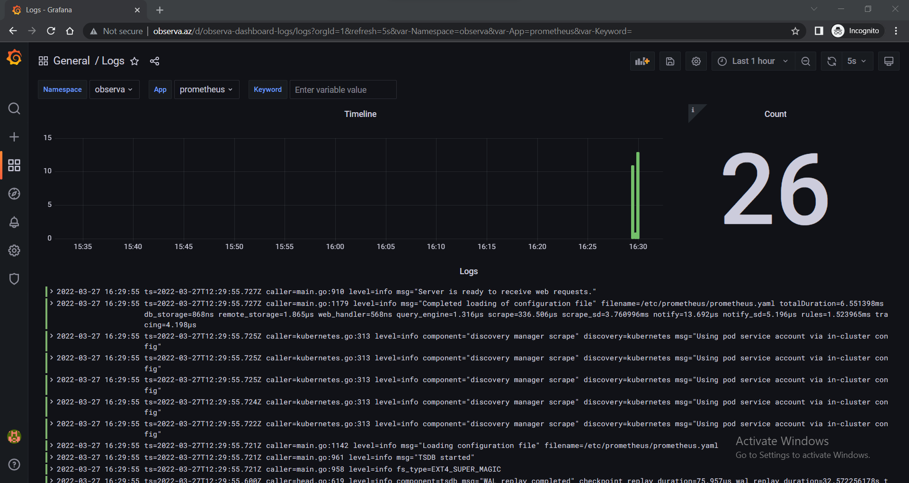
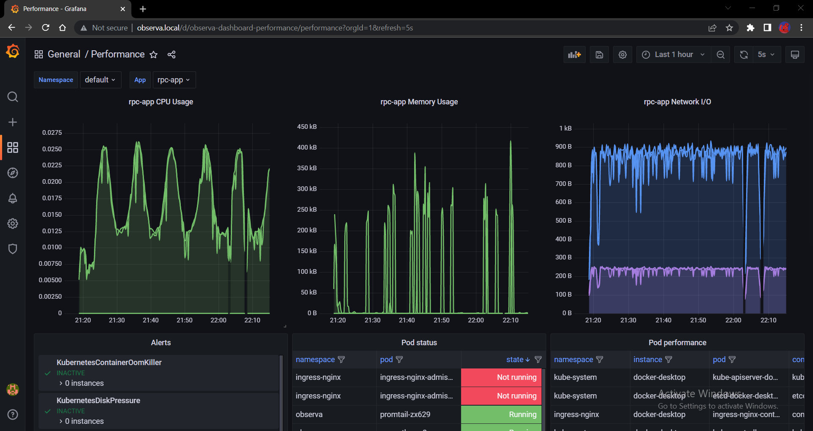
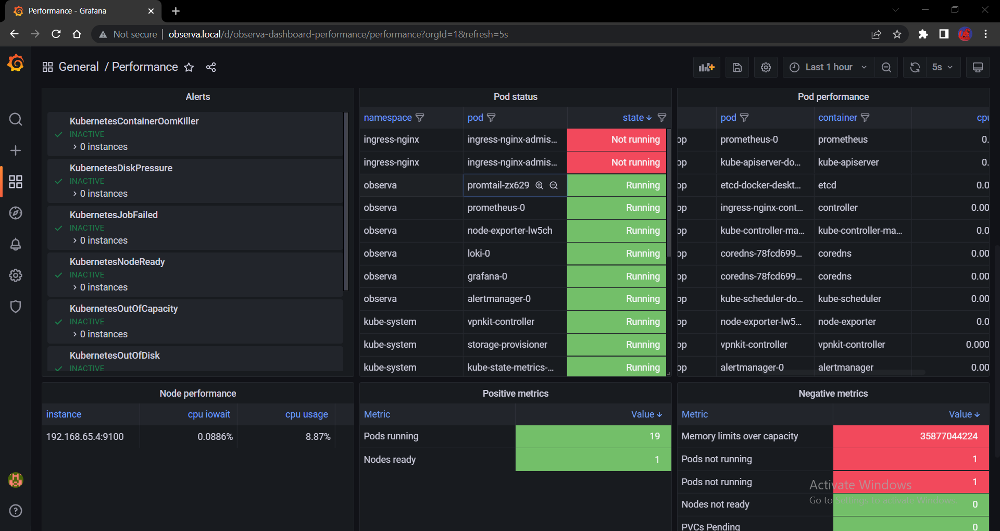

<h1 align="center"> OBSERVA </h1>
<p align="center">     </p> 
Out of the box repeatable Kubernetes monitoring stack consisting of Prometheus,Grafana,Promtail,Loki,Alertmanager and packed as a Helm chart. Just deploy and observe!

\
_The project was developed for personal use and is still under development. Maybe this is not perfect solution, but it does its job and may inspire you to make something greater!_

## Features and Usage
- __Log monitoring__. Promtail collects container logs and send them to Loki. You can observe logs in realtime, search them by __app__ label and keywords in __Logs__ dashboard in Grafana.

- __Performance monitoring__. Get aggregated resource usage metrics of your __app__ containers in one place. Also cluster|node|pod states, alerts and etc.


- __Alerts__. To recieve alerts from Alertmanager, just define your monitoring rules in __prometheus/__ and setup __alertmanager/alertmanager.yaml__
- __Simplicity__. 
  - Edit dashboards in browser and save JSON files to __grafana-dashboards/__ or provision new dashboards in the same way
  - No complicated template files or chart dependencies
  - One command deploy ```helm upgrade --install --set grafana.host=observa.az observa .```
  - Everything "as Code"

## Tested on:
- kubernetes v1.22.5
- kube-state-metrics 2.4.2